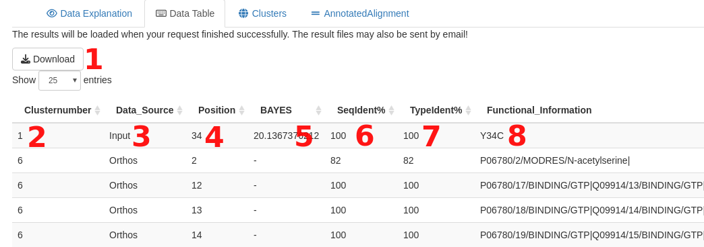
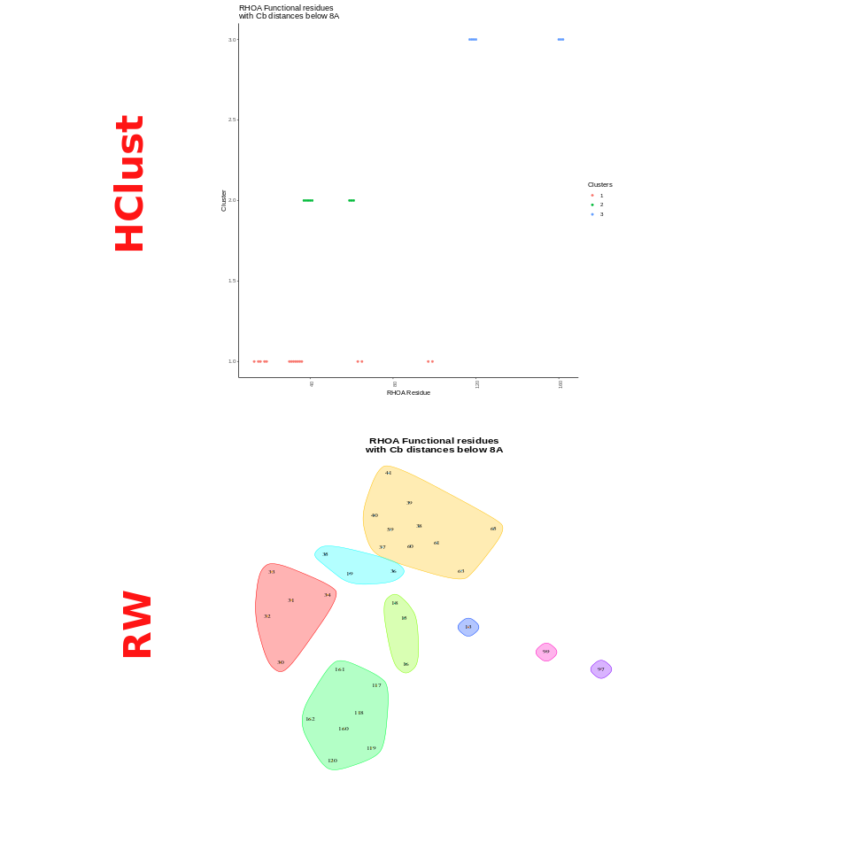
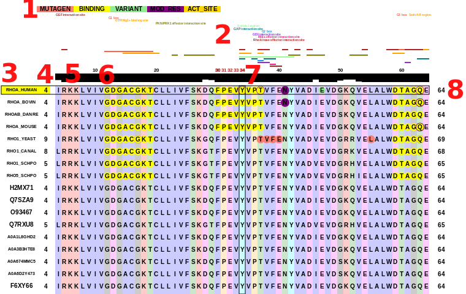

# PROTEORIZER
[Proteorizer](http://shiny.russelllab.org/proteorizer) is an explorative tool that takes variants from laboratory or clinical settings and contextualizes the variants based on prior information from the protein of interest and similar proteins according to where these functional positions are located in the 3D structure of the protein of interest.


# Please Cite
When using insights generated with Proteorizer please cite **PUBLICATION**.

# Introduction
This tool is a spritual successor to the work published in 2022 ```Schmenger et al. "Never-homozygous genetic variants in healthy populations are potential recessive disease candidates" (https://doi.org/10.1038/s41525-022-00322-z)```.

The idea of **Proteorizer** is to use information available for the protein of interest (your submission) and similar proteins (retrieved via Orthofinder or from your submitted custom alignment). Information of similar proteins is mapped back to the protein of interest, which is used to define functional clusters by measuring intramolecular distances.

Idea: If you know the function and effects of residues and mutations physically close to the position of interest, you might use this knowledge to better understand the effects of the variant in question.

We offer two different methods of how these clusters are defined ([Random Walk](https://igraph.org/r/doc/cluster_walktrap.html) and [Hierarchical Clustering](https://www.rdocumentation.org/packages/stats/versions/3.6.2/topics/hclust)).

Several features were used to perform **bayesian integration** (see the paper [above](https://doi.org/10.1038/s41525-022-00322-z)). While **not being the main focus** of this approach we also provide scores based on the selected method. **Scores above 15** should be highlighting interesting cases. Additionally, we trained a predictor (via scikit-learn, using a **Random Forest classifier**) to decide on whether the available data suggests that a given mutation does have an impact on protein function. **Scores between 0.5 - 1** indicate as such. 
We hope that if both classifiers (Bayes & Random Forest) are positive (**Bayes above 15 & Random Forest above 0.75**) we can more safely conclude that the variant is likely to have an impact.

The final results include the **functional and mapped-back information**, a **graphical representation of clusters** as well as an **annotated alignment**.


# How to use
## R-Shiny Application

### Preparing a custom alignment
The following steps can be used to create an alignment simply using blastp and clustal omega. <br>
**Note:** The bigger the alignment, the more time your request will consume. It is recommended to use not more than ~ 100 aligned sequences.

#### Step 1
Download the fasta sequence of your protein of interest. For RHOA you could do this via Uniprot, like [this](https://rest.uniprot.org/uniprotkb/P61586.fasta). <br>
**Note**: You can easily build this url using **https://rest.uniprot.org/uniprotkb/** + uniprotID +**.fasta**

#### Step 2
Use the downloaded fasta sequence to perform a blast search for similar sequences [blastp](https://blast.ncbi.nlm.nih.gov/Blast.cgi?PAGE=Proteins). For more information on how to use BLAST please see [Blast Help](https://blast.ncbi.nlm.nih.gov/doc/blast-help/). **Make sure to select "Swissprot" as a database, or otherwise make sure that the retained accessions will be UniprotIDs.**

#### Step 3
Select the sequences you prefer and download them. <br>
**Note**: Make sure to download the complete sequences.
  
#### Step 4
Add the protein of interests fasta manually to the top of the just downloaded file, if it isn't present already. Change the formatting to roughly mimic the formatting of the remaining entries.
  
#### Step 5
Perform a multiple sequence alignment using [Clustal Omega](https://www.ebi.ac.uk/Tools/msa/clustalo/). Make sure to select **Protein**. Download & save the alignment file for usage with this script. Input the sequences via copy & paste or upload a file.

Make sure you download the complete MSA (including the clustal version, followed by 2 empty lines, followed by the MSA).

### Submitting your request
Please format the request following this simple rule:
**Identifier/Mutations**
- Identifier could be UniProtID or Gene Name. 
- Please separate multiple mutations using "," (comma).
Examples: 
- **P61586/Y34C,E40K** 
- **RHOA/Y34C**

### Reviewing the results
#### The Data Table

|
|:--:| 
| *The data table.* |

- 1: **Download button**: Download your results here.
- 2: The **cluster number** of this particular entry. Datatable can be sorted accordingly.
- 3: **Data Source**. Should be **Input**, **UniProt** (= information directly for the protein of interest) or **Orthos** (= information mapped to the protein of interest).
- 4: **Position**, indicating the protein of interest residue number.
- 5: **BAYES score**, values above 13 indicate a higher chance for the input position to be relevant for the function of the protein.
- 6: **Sequence Identity** indicates how strongly the input protein amino acid is conserved across all sequences of the alignment.
- 7: **Type Identity** indicates how strongly the input protein amino acid type is conserved across all sequences of the alignment.
- 8: **Functional Information** directly shows the uniprot info that was extracted & used.
- 9 (not shown): **Mechismo Information** refers to previous work of AG Russell, please see [Mechismo](mechismo.russelllab.org).

___
#### Clusters

|
|:--:| 
| *Clusters* |

This resultfile typically gives a representation of clusters detected for the protein of interest. The type of image will differ based on the cluster method selected.

___
#### Alignment Annotation

|
|:--:| 
| *The annotated alignment* |

- 1: Legend. Circles on the alignment follow the color categories based on entry types from UniProt.
- 2: Protein features taken from Interpro.
- 3: IDs for each sequence. Where possible UniprotIDs (from the input alignment) are translated into gene names.
- 4: The shown starting position for each aligned sequence.
- 5: Sequence conservation. Corresponds to sequence identity for this position of the alignment. **Note** Columns of the alignment are colored based on amino acid type if the amino acid type (of the protein of interest) is more than 70 % conserved at this position.
- 6: Residue numbering for the protein of interest.
- 7: Positions clustered together with the input position (here **34**) are displayed with the same color. A rectangle highlights the position of interest.
- 8: The shown ending position for each aligned sequence.

**Note**: IF multiple positions are given, then the complete alignment is annotated and shown. This might produce large .svg files. 


# External (public) sources
- [Alphafold2 Structures, Human](https://alphafold.ebi.ac.uk/download#proteomes-section)
- [Uniprot](https://www.uniprot.org/)
- [Interpro](https://www.ebi.ac.uk/interpro/)
- [Humsavar](https://ftp.uniprot.org/pub/databases/uniprot/current_release/knowledgebase/complete/docs/humsavar.txt)
- [gnomAD](https://gnomad.broadinstitute.org/)

# To-Do
- improve stability
