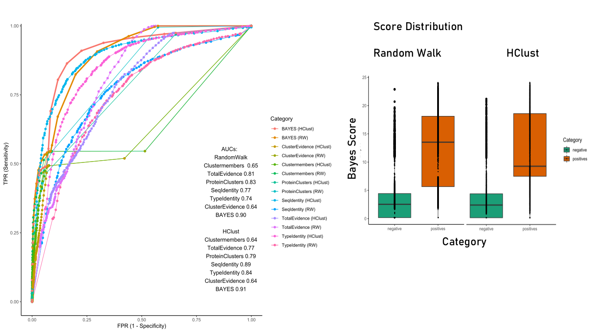

# Shiny-Server

## Scoring Metrics

Several features were used to perform bayesian integration (see the paper [above](https://doi.org/10.1038/s41525-022-00322-z)). While **not being the main focus** of this approach we also provide scores based on the selected method. **Scores above 15** should be highlighting interesting cases (**Fig.1A**).

|
|:--:| 
| *Fig 1A. Overview of bayesian score distribution and ROC curves of RW-bayes and HClust-bayes, together with the chosen features* |

Machine learning was performed using a Random Forest Classifier trained on the same dataset as our bayesian classifier. However, we introduced additional features (such as the Mutscore derived from Betts and Russell, see [russelllab.org/aas](http://russelllab.org/aas)). For the performance please see (**Fig.1B**).

|
|:--:| 
| *Fig 1B. Overview of machine learning performance.* |

## Datasets to browse
The two datasets to choose from (**Proteorizer_RW_VUS_Humsavar** and **Proteorizer_HClust_VUS_Humsavar**) were created by using this tool's method (using either Random Walk **RW** or Hierachical Clustering **HClust**) on variants of unknown significance (VUS) from [Humsavar.txt](https://ftp.uniprot.org/pub/databases/uniprot/current_release/knowledgebase/complete/docs/humsavar.txt).

**Note: As of now, only the bayesian classifier was applied to create these sets.**
Only cases were clustering on the protein of interest was successful can be selected.

