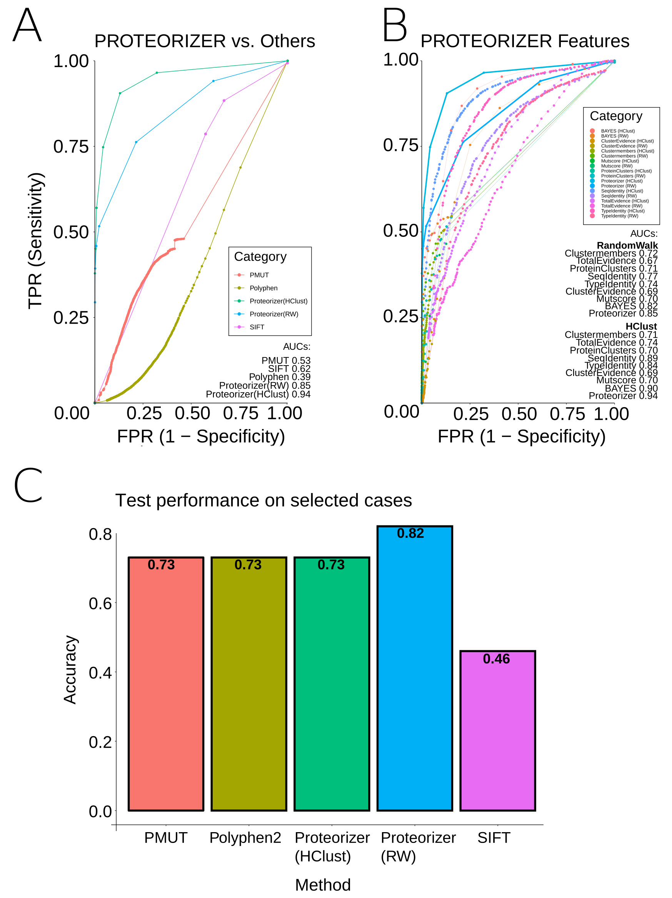

# Shiny-Server

## Scoring Metrics
Several features were used to perform bayesian integration (see the paper [above](https://doi.org/10.1038/s41525-022-00322-z)). While **not being the main focus** of this approach we also provide scores based on the selected method. **Scores above 15** should be highlighting interesting cases.

Machine learning was performed using a Random Forest Classifier trained on the same dataset as our bayesian classifier. However, we introduced additional features (such as the Mutscore derived from Betts and Russell, see [russelllab.org/aas](http://russelllab.org/aas)). For the performance please see (**Fig.1**). **Scores above 0.75** should be highlighting interesting cases with good confidence.

|
|:--:| 
| *Fig 1. Overview of machine learning performance.* |

Both scoring metrics were ultimately combined to arrive at a conservative verdict. Most attention should be spent on variants where the verdict is **Impact (High**, indicating that both metrics individually strongly suggest a functional impact of the variant in question. 
This combined approach holds up well against other popular tools, too (**Fig. 2**).

|
|:--:| 
| *Fig 2. Overview of overall performance.* |

## Datasets to browse
The two datasets to choose from (**VUS_Humsavar_RW** and **VUS_Humsavar_HClust**) were created by using this tool's method (using either Random Walk **RW** or Hierachical Clustering **HClust**) on variants of unknown significance (VUS) from [Humsavar.txt](https://ftp.uniprot.org/pub/databases/uniprot/current_release/knowledgebase/complete/docs/humsavar.txt).

Only cases were clustering on the protein of interest was successful can be browsed.

