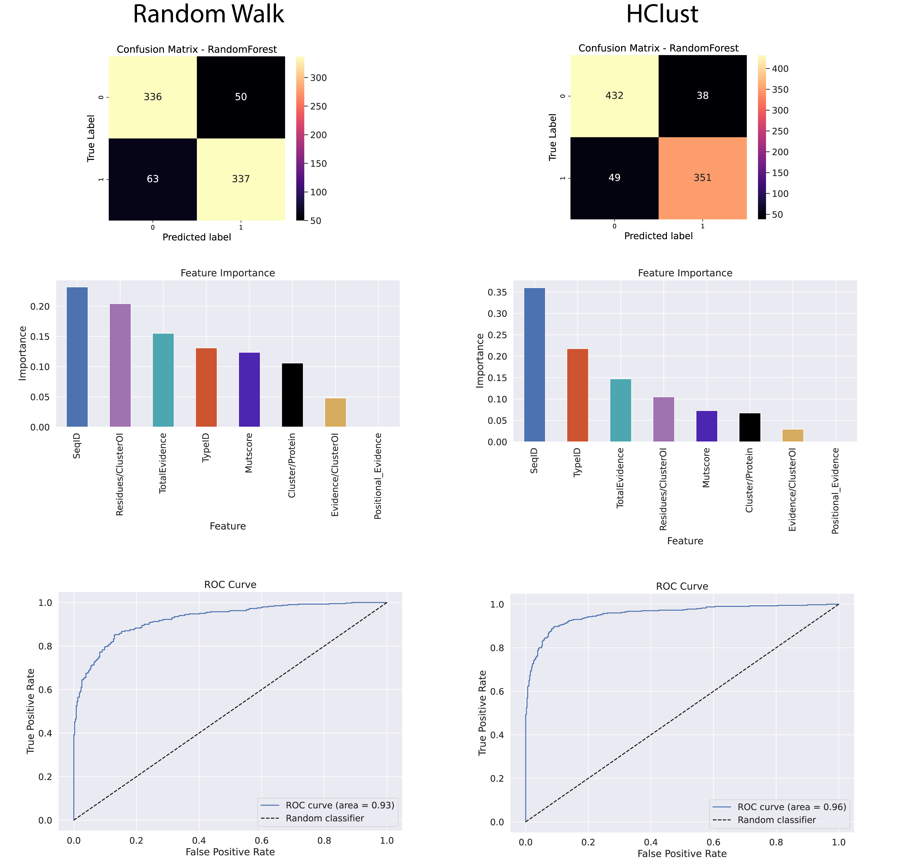

___
# Instructions

Enter your request in the 'Submit' tab.

Click the 'Submit' button and wait for the results to be generated. You can download the result table and images manually.

## Format
Please format the request following this simple recipe:

**Identifier/Mutations**

- Identifier could be UniProtID or Gene Name. 
- Please separate multiple mutations using "," (comma).

Examples: 

- **P61586/Y34C,E40K** 
- **RHOA/Y34C**

___
# Background

This tool is a spritual successor to the work published in 2022 ```Schmenger et al. "Never-homozygous genetic variants in healthy populations are potential recessive disease candidates" (https://doi.org/10.1038/s41525-022-00322-z)```.

The idea of **CONNECTOR**/**StructoMate**/**Proteorizer** is to use information available for the protein of interest (your submission) and similar proteins (retrieved via Orthofinder or your submitted alignment). Information of similar proteins is mapped back to the protein of interest, which is used to define functional clusters by measuring intramolecular distances (see **Fig 1** for a more detailed overview and the following publication **insert publication here**)

--> If you know the function and effects of residues and mutations physically close to the position of interest, you might use this knowledge to better understand the effects of your mutation of interest.


|
|:--:| 
| *Fig 1. A brief outline of the Proteorizer workflow* |


We offer two different methods of how these clusters are defined ([Random Walk](https://igraph.org/r/doc/cluster_walktrap.html) and [Hierarchical Clustering](https://www.rdocumentation.org/packages/stats/versions/3.6.2/topics/hclust)).

Several features were used to perform bayesian integration (see the paper [above](https://doi.org/10.1038/s41525-022-00322-z)). While **not being the main focus** of this approach we also provide scores based on the selected method. **Scores above 15** should be highlighting interesting cases.


Machine learning was performed using a Random Forest Classifier trained on the same dataset as our bayesian classifier. However, we introduced additional features (such as the Mutscore derived from Betts and Russell, see [russelllab.org/aas](http://russelllab.org/aas)). For the performance please see (**Fig.2**).

|
|:--:| 
| *Fig 2. Overview of machine learning performance.* |


We then combined both the naive bayesian score & the ML predictor to arrive at a final verdict. The necessity for both scores to agree with their prediction creates a more conservative assessment (**Fig. 3**).

|
|:--:| 
| *Fig 3. Performance of PROTEORIZER vs. other popular tools.* |


The final results include the **functional and mapped-back information**, a **graphical representation of clusters** as well as an **annotated alignment**.

___
# Preparing a custom alignment
The following steps can be used to create an alignment simply using blastp and clustal omega. <br>
**Note:** The bigger the alignment, the more time your request will consume. It is recommended to use not more than ~ 100 aligned sequences.

#### Step 1
Download the fasta sequence of your protein of interest. For RHOA you could do this via Uniprot, like [this](https://rest.uniprot.org/uniprotkb/P61586.fasta). Note: You can easily build this url using **https://rest.uniprot.org/uniprotkb/** + uniprotID +**.fasta**

#### Step 2
Use the downloaded fasta sequence to perform a blast search for similar sequences [blastp](https://blast.ncbi.nlm.nih.gov/Blast.cgi?PAGE=Proteins). For more information on how to use BLAST please see [Blast Help](https://blast.ncbi.nlm.nih.gov/doc/blast-help/). **Make sure to select "Swissprot" as a database, or otherwise make sure that the retained accessions will be UniprotIDs.**


#### Step 3
Select the sequences you prefer and download them.

|
|:--:| 
| *Fig 4. Make sure to download the complete sequences.* |

  
#### Step 4
Add the protein of interests fasta manually to the top of the just downloaded file. Change the formatting to roughly mimic the formatting of the remaining entries.

|
|:--:| 
| *Fig 5. This is how your prepared fasta sequences should look like.* |

  
  
#### Step 5
Perform a multiple sequence alignment using [Clustal Omega](https://www.ebi.ac.uk/Tools/msa/clustalo/). Make sure to select **Protein**. Download & save the alignment file for usage with this script. Input the sequences via copy & paste or upload a file.

|
|:--:|
|*Fig 6.*|


Make sure you download the complete MSA (including the clustal version, followed by 2 empty lines, followed by the MSA).


